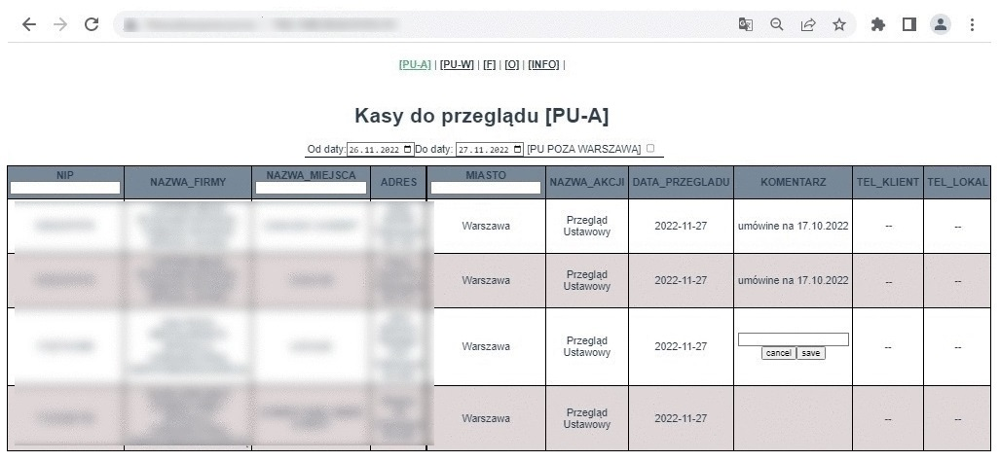

# Sekafi CRM - UI Raports

### 

Raporty generowane przez dashbort to: 
 - Raport nadchodzących akcji;
 - Raport wykonanych akcji;
 - Raport wykonanych fiskalizacji;
 - Raport wykonanych odczytów likwidacyjnych. 

Dodatkowe funkcjonalności: 
 - Możliwość wystawienie FV przez API fakturownia.pl do zakończonych akcji.

#### Powered by

- [Apollo](https://www.apollographql.com/) 
- [VueJs](https://vuejs.org/)

#### Credits

- [Sekfi](https://sekafi.pl/)
